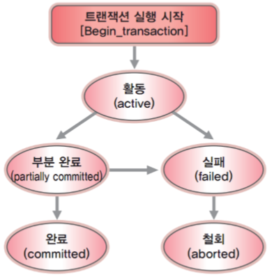
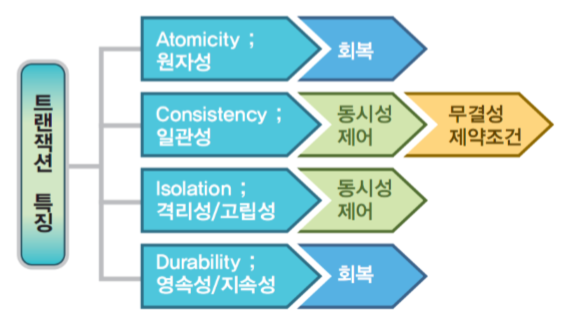
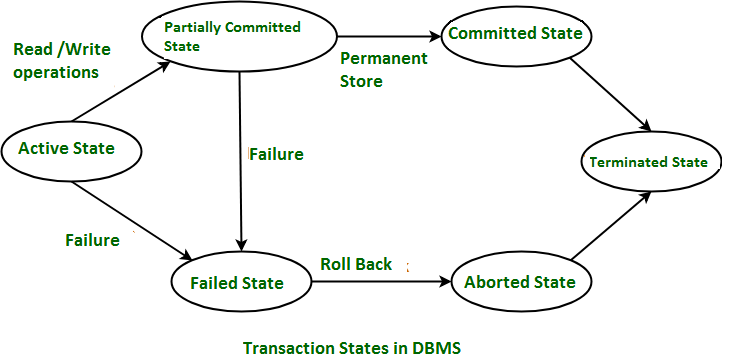

[문제] 동시에 같은 DB Table row 를 업데이트 하는 상황을 방어하기 위해 어떻게 개발하실 건지 설명해주세요.

# 관련 개념

## 트랜잭션Transaction

- DBMS에서 데이터를 다루는 논리적인 작업의 단위.
- 데이터를 다룰 때 장애가 일어난 경우 데이터를 복구하는 작업의 단위가 된다.
- 여러 작업이 동시에 데이터릘 다룰 때 이 작업을 서로 분리하는 단위가 된다.
- 전체가 수행되거나 전혀 수행되지 않아야 한다: All or Nothing -> 작업의 일부만 적용(partial update)하는 현상이 발생하지 않게 만들어준다.

### ACID: 트랜잭션의 특성

#### Atomicity
원자성. 트랜잭션에 포함된 작업은 전부 수행되거나 전부 수행되지 않아야 한다.
#### Consistency
일관성. 트랜잭션을 수행하기 전이나 후나 데이터베이스는 항상 일관된 상태를 유지해야 한다.
#### Isolation
고립성. 수행 중인 트랜잭션에 다른 트랜잭션이 끼어들어 변경 중인 데이터 값을 훼손하지 않아야 한다.
#### Durability
지속성. 수행을 성공적으로 완료한 트랜잭션은 변경한 데이터를 영구히 저장해야 한다.

### 트랜잭션의 특성을 지키기 위한 방안들

- 트랜잭션이 실행되다 장애에 의해 부분 완료되는 상황은 원자성과 지속성이라는 속성에 위배된다.DBMS는 이런 속성을 지키기 위해 **회복 관리자 프로그램**을 사용한다. 일부만 진행된 트랜잭션을 취소시켜 *원자성*을 유지할 뿐 아니라 값을 트랜잭션 이전의 상태로 복원시켜 *지속성*을 유지시켜 준다.
- 또한 *일관성*과 *고립성*을 유지하기 위해서 값에 동시에 접근하지 않도록 하므로 **동시성 제어(Concurrency Control)**을 활용한다.
- 더하여, 잘못된 값에 대한 입력이 오면 일관성이 무너질 수 있으므로 **무결성 제약조건**도 활용한다.

## 트랜잭션 상태

- 활성 상태(Active State)
    - 트랜잭션의 명령이 실행 중일 때 트랜잭션은 활성 상태에 있다.
    - 모든 읽기 및 쓰기 작업이 오류 없이 수행되면 "부분적으로 커밋된 상태"로 이동.
    - 실패하면 "실패한 상태"로 이동
- 부분적으로 커밋된 상태(Partially Committed)
    - 변경 사항이 주 메모리 또는 로컬 버퍼에 적용된다.
    - 변경사항이 데이터베이스에 영구적으로 적용되면 "커밋된 상태"로 변경되고, 실패하면 "실패한 상태"로 이동
- 실패한 상태(Failed State)
- 중단된 상태(Aborted Sate)
    - 어떤 유형의 실패가 발생하면 트랜잭션은 
- 커밋된 상태(Committed State)
- 종료된 상태(Terminated State)
    - 롤백이 없거나 트랜잭션이 "커밋된 상태"에서 온 경우 시스템은 일관성을 유지하고 새로운 트랜잭션을 준비하여 이전 트랜잭션은 종료된다

[출처: Transaction Staes in DBMS, GeeksForGeeks](https://www.geeksforgeeks.org/transaction-states-in-dbms/)

# 동시성을 관리하기

- 트랜잭션 분리(Isolation of Transactions)
- 락(Locking)
    - 데이터베이스의 특정 부분에 대한 액세스 권한을 얻는 메커니즘, mutual exclusive 기능 제공하는 기법
    - 비관적 잠금: 공유 락(읽기 전용)과 배타적 락(쓰기 전용)
    - 낙관적 잠금
- 데드락 관리(Deadlock Management)
- 동시성 제어 기법(Concurrency Control Technology): 트랜잭션의 실행 순서를 제어하는 기법
- 버전 관리(Version Control)

[읽을 거리: 멀티스레드 설계를 위한 8 가지 규칙](https://brunch.co.kr/@chris-song/95)

## 데드락

두 개 이상의 트랜잭션이 서로가 보유한 리소스를 기다리며 서로를 차단하는 상황. 주로 다중 사용자 환경에서 두 개 이상의 트랜잭션이 동시에 실행되고 서로 다른 순서로 동일한 데이터에 접근하려 할 때 발생한다. 일반적으로 DBMS에서 자동으로 제공된다.

### 일정 시간 후에 트랜잭션이 잠금을 강제로 해제하도록 하는 타임아웃 메커니즘
### 데드락 사이틀을 찾기 위해 트랜잭션 사이클을 찾기 위해 주기적으로 트랜잭션 로그를 검사하는 데드락 감지 알고리즘

[출처: Deadlock, GeeksForGeeks](https://www.geeksforgeeks.org/deadlock-in-dbms/)

# 동시성 해결을 위한 다양한 차원에서의 관리 방법

동시성 문제를 해결하기 위해 여러 차원에서 이를 위한 방지책을 찾아볼 수 있다.

## 방법: Locking(잠금)

### 행 잠금
**충돌의 발생을 대처**하기 위한 방식으로 하나의 데이터를 여러 커넥션에서 동시에 변경하여 해당 레코드가 예측할 수 없는 상태가 되는 것을 방지한다.

### 낙관적/비관적 잠금
- 비관적 잠금: 동일한 데이터를 동시에 수정할 가능성이 높다는 가정하에 잠금을 거는 방식. 스레드 1이 선점한 aggregate의 사용이 끝날 때 까지 스레드 2의 접근은 블로킹 된다. 이 방식은 DBMS가 제공하는 행단위 잠금을 사용해서 구현한다.
- 낙관적 잠금: 데이터 갱신 시 충돌이 발생하지 않을 것으로 여겨 잠그는 기법이다. 실제 잠금을 하지 않고, 변경한 데이터를 실제 DBMS에 반영하는 시점에 변경 가능 여부를 확인하는 방식이다. 테이블에 버전으로 사용할 숫자 타입 프로퍼티를 추가하고, 애그리거트를 수정할 때마다 이 값을 1 씩 증가시킨다.

## 도구: 버전 관리

MVCC(Multi-Version Concurrency Control)을 사용하는 데이터베이스 시스템에서는 트랜잭션을 처리할 때 자동으로 버전 관리가 이루어진다. 각 **트랜잭션에 대해 데이터의 특정 버전을 생성하고 관리**하여, 여러 트랜잭션이 동시에 같은 데이터를 읽을 수 있게 한다. 한 트랜잭션이 데이터를 변경하였더라도 다른 트랜잭션은 해당 변경사항을 보지 못하고 원래 데이터를 계속 볼 수 있다.
-> MySQL의 InnoDB 스토리지 엔진, PostgreSQL, InterBase, SQL Server에서 지원함.

## 동시성 제어 기법

### 

## Java Spring에서 동시성 관리를 하기위한 기술들

[Spring의 트랜잭션과 Spring이 제공하는 트랜잭션 핵심 기술들](https://mangkyu.tistory.com/154)

[출처: Concurrency Control Techniques, GeeksForGeeks](https://www.geeksforgeeks.org/concurrency-control-techniques/)

# 더 많은 읽을 거리들

[낙관적/비관적 잠금](https://hwannny.tistory.com/81)

[트랜잭션, 동시성 제어와 회복](https://mangkyu.tistory.com/30)

