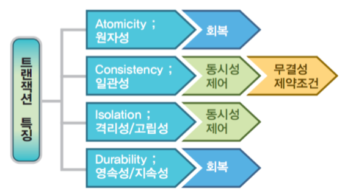

[문제] 동시에 같은 DB Table row 를 업데이트 하는 상황을 방어하기 위해 어떻게 개발하실 건지 설명해주세요.

# 관련 개념
## 트랜잭션Transaction
- DBMS에서 데이터를 다루는 논리적인 작업의 단위.
- 데이터를 다룰 때 장애가 일어난 경우 데이터를 복구하는 작업의 단위가 된다.
- 여러 작업이 동시에 데이터릘 다룰 때 이 작업을 서로 분리하는 단위가 된다.
- 전체가 수행되거나 전혀 수행되지 않아야 한다: All or Nothing -> 작업의 일부만 적용(partial update)하는 현상이 발생하지 않게 만들어준다.
### ACID

트랜잭션의 정합성을 보장하기위한 성질들
#### Atomicity
원자성. 트랜잭션에 포함된 작업은 전부 수행되거나 전부 수행되지 않아야 한다.
#### Consistency
일관성. 트랜잭션을 수행하기 전이나 후나 데이터베이스는 항상 일관된 상태를 유지해야 한다.
#### Isolation
고립성. 수행 중인 트랜잭션에 다른 트랜잭션이 끼어들어 변경 중인 데이터 값을 훼손하지 않아야 한다.
#### Durability
지속성. 수행을 성공적으로 완료한 트랜잭션은 변경한 데이터를 영구히 저장해야 한다.

## 동시성 제어: 커밋과 롤백

## 트랜잭션 상태
## 데드락 ✨✨✨

참고: https://mangkyu.tistory.com/30

# 동시성 해결을 위한 방법들
동시성 문제를 해결하기 위해 여러 차원에서 이를 위한 방지책을 찾아볼 수 있다.
## 행 잠금: 낙관적/비관적 잠금
### 행 잠금
**충돌의 발생을 대처**하기 위한 방식으로 하나의 데이터를 여러 커넥션에서 동시에 변경하여 해당 레코드가 예측할 수 없는 상태가 되는 것을 방지한다. 이러한 잠금은 JPA나 Hibernate같은 
### 낙관적/비관적 잠금
- 비관적 잠금: 동일한 데이터를 동시에 수정할 가능성이 높다는 가정하에 잠금을 거는 방식. 스레드 1이 선점한 aggregate의 사용이 끝날 때 까지 스레드 2의 접근은 블로킹 된다. 이 방식은 DBMS가 제공하는 행단위 잠금을 사용해서 구현한다.
- 낙관적 잠금: 데이터 갱신 시 충돌이 발생하지 않을 것으로 여겨 잠그는 기법이다. 실제 잠금을 하지 않고, 변경한 데이터를 실제 DBMS에 반영하는 시점에 변경 가능 여부를 확인하는 방식이다. 테이블에 버전으로 사용할 숫자 타입 프로퍼티를 추가하고, 애그리거트를 수정할 때마다 이 값을 1 씩 증가시킨다.
## 버전 관리
MVCC(Multi-Version Concurrency Control)을 사용하는 데이터베이스 시스템에서는 트랜잭션을 처리할 때 자동으로 버전 관리가 이루어진다. 각 **트랜잭션에 대해 데이터의 특정 버전을 생성하고 관리**하여, 여러 트랜잭션이 동시에 같은 데이터를 읽을 수 있게 한다. 한 트랜잭션이 데이터를 변경하였더라도 다른 트랜잭션은 해당 변경사항을 보지 못하고 원래 데이터를 계속 볼 수 있다.
-> MySQL의 InnoDB 스토리지 엔진, PostgreSQL, InterBase, SQL Server에서 지원함.

# Java Spring에서 DB 동시성 관리
## AOP: 비즈니스 기능과 그 외 기능의 분리 - annotation
## 선언적 트랜잭션괴 프로그래매틱 트랜잭션

# 결론

# 출처
=> 더 자세한 내용이 많기 때문에 읽어보는 것을 매우 추천함
낙관적/비관적 잠금: https://hwannny.tistory.com/81
Spring의 트랜잭션과 Spring이 제공하는 트랜잭션 핵심 기술들: https://mangkyu.tistory.com/154
