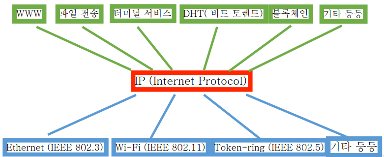

(2) TCP 와 UDP 의 차이를 작성해주세요.

# 배경 지식

## 네트워크

- 상호 연결되어 있는 사람들이나 사물들로 이루어진 그룹이나 시스템
- <U>사람/사물을 **점**</U>으로 표시하고 그들간의 <U>어떤 관계를 **선**</U>으로 표시한 것

## IP: Internet Protocol

네트워크를 연결하는 프로토콜(Protocol: "약속", 즉, 의사소통을 위해 맞추어야 하는 규약)

인터넷(Internet)의 초기 목표를 살펴볼 필요가 있다.
ARPANET이라는 네트워크와 ARPA라는 패킷 라디오 네트워크의 관리를 위한 도구였다.
-  구성하는 네트워크 중 일부가 동작하지 않아도 계속 작동해야 함
- 다양한 통신 서비스 지원
- 다양한 네트워크 수용 가능
- 중앙집중식이 아닌 분산처리 방식의 자원 관리
- 비용 효율적
- 적은 비용으로 호스트 추가 가능
- 누가 어느 정도 리소스를 쓰는지 추적 가능

(출처: The Design Philosophy of the DARPA Internet Protocols, David D. Clark et al., Proc. SIGCOMM ‘88)

IP의 역할은 Hour Glass 모델로 구현되어 있다. ~~잘 보면 모래시계 같지 않은가~~ IP가 네트워크의 작동에서 hour glass의 허리라는 것에는 다음과 같은 의미가 있다.
- 어떤 물리적 연결 기술이던 IP만 구현하면 다양한 서비스(소프트웨어)를 구동할 수 있다. 즉, <U>어떤 서비스(소프트웨어) 든 **IP로만 구현하면 다양한 물리적 연결 기술로 된 네트워크에서 동작**시킬 수 있는 것이다.</U>

