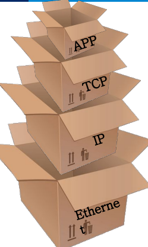
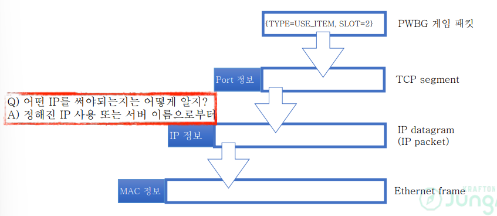
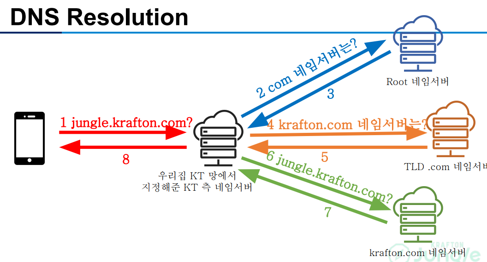
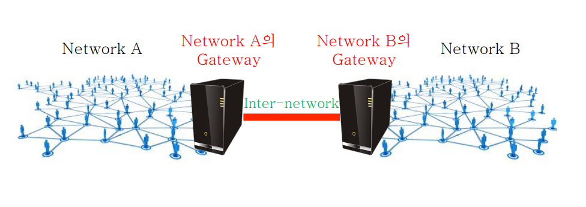
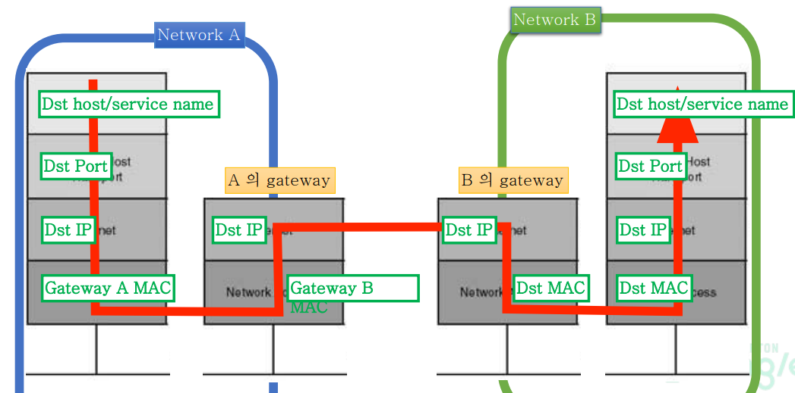
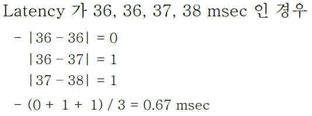
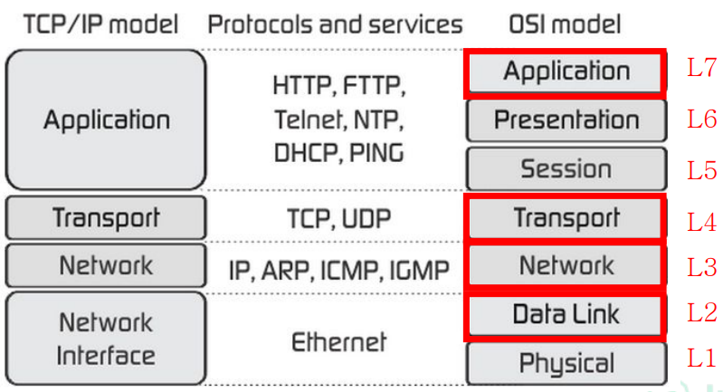

(2) TCP 와 UDP 의 차이를 작성해주세요.

# 배경 지식

## 네트워크

- 상호 연결되어 있는 사람들이나 사물들로 이루어진 그룹이나 시스템
- <U>사람/사물을 **점**</U>으로 표시하고 그들간의 <U>어떤 관계를 **선**</U>으로 표시한 것

## IP: Internet Protocol

네트워크를 연결하는 프로토콜(Protocol: "약속", 즉, 의사소통을 위해 맞추어야 하는 규약)

인터넷(Internet)의 초기 목표를 살펴볼 필요가 있다.
ARPANET이라는 네트워크와 ARPA라는 패킷 라디오 네트워크의 관리를 위한 도구였다.
-  구성하는 네트워크 중 일부가 동작하지 않아도 계속 작동해야 함
- 다양한 통신 서비스 지원
- 다양한 네트워크 수용 가능
- 중앙집중식이 아닌 분산처리 방식의 자원 관리
- 비용 효율적
- 적은 비용으로 호스트 추가 가능
- 누가 어느 정도 리소스를 쓰는지 추적 가능

(출처: The Design Philosophy of the DARPA Internet Protocols, David D. Clark et al., Proc. SIGCOMM ‘88)

IP의 역할은 Hour Glass 모델로 구현되어 있다. ~~잘 보면 모래시계 허리에 IP가 있다~~ IP가 네트워크의 작동에서 hour glass의 허리라는 것에는 다음과 같은 의미가 있다.
- 어떤 물리적 연결 기술이던 IP만 구현하면 다양한 서비스(소프트웨어)를 구동할 수 있다. 즉, <U>어떤 서비스(소프트웨어) 든 **IP로만 구현하면 다양한 물리적 연결 기술로 된 네트워크에서 동작**시킬 수 있는 것이다.</U>

## 네트워크의 계층형 구조

### 먼저, 아키텍처란?
- 구조
- 아키텍처의 설계(다음을 고려하는 것이 아키텍처의 설계이다.)
    1. 어떤 컴포넌트가 존재하는가?
    2. 컴포넌트 들은 어떻게 상호작용 하는가?
- 계층형, 이벤트 기반, MVC, 파이프 필터, Client-server형, Peer-to-peer형, 마이크로 서비스 등이 존재한다.

### 네트워크는 계층형(Layered)으로 이루어져 있다.

계층형 아키텍처를 취함으로써 네트워크가 얻는 장점은?
1. 단순화
    - 각 계층에서는 제공할 기능만 고려한다: funcationality
    - 각 계층은 자기 바로 아래 계층을 어떻게 사용하지만 고려한다: interface
2. 문제 해결의 편의성
    - 문제가 있는 계층만 디버깅 한다.
    - 각 계층이 단순하여 문제 해결도 용이함
3. 진화의 편의성
    - 각 계층은 바로 위 계층에 알려준 "어떻게 쓰는지"만 유지하면 된다.
    - 그 외에는 자유롭게 개선/추가가 가능함.

단점은?
잠재적 비효율성
    - 계층 간의 소통은 비효율적일 수 있다.
    - 직접적인 바로 아래 계층이 아닌 건너 뛰어야 할 경우 난점이 발생한다.
    - 어떤 계층을 건드릴 경우 상위의 모든 계층이 영향을 받는다.

### 네트워크의 계층 구성: OSI 7 계층 모형

OSI 7 계층 모형은 Reference model이다.
기준 모델이므로 실제 구현체가 아니지만 계층 구조를 만들 때 기준이 된다.

[!OSI 7계층](./Images/OSI%207%20계층.png)

 

#### 물리계층(Data Link Layer)
#### 데이터 링크 계층(Network Layer)
#### 네트워크 계층(Transport Layer)
#### 세션 계층(Session Layer)
#### 표현 계층(Presentation Layer)
#### 응용 계층(Application Layer)

### Box-In-Box

어떤 식으로 계층마다 식별가능한 정보를 담는가?
전달하는 데이터에 헤더를 추가하여 각 계층에서 식별할 수 있는 정보들을 덧씌워 전달한다. 마치 Box-in-Box 와 같은 형태로 되어있다.

 

## 목적지 찾기: 주소 요소들은 어떻게 찾을까?

### Port 정보

Port 번호는 정해놓고 사용한다

### IP 정보: DNS 서버에서 IP 정보 찾기
IP 주소보다는 사이트 이름이 사용자에게 더 기억하기 쉽다: DNS 는 사이트 이름-IP 매칭을 기억하는 저장소이다.

**DNS resolution**: 서버 이름으로부터 IP를 알아내는 행동

- 매우 iterative한 작업
- Root 와 Top-level domain(TLD) 서버는 부하가 크다
- DNS caching
    - DNS 정보는 빈번하게 바뀌지 않는다.
    - Caching을 통해 high scalability와 low latency를 모두 이룰 수 있음.

### MAC 정보: IP에서 MAC 알아내기

- IP는 네트워크를 연결한다.
- MAC은 IP보다 아래 있으므로 네트워크 안에서 식별할 수 있음
- MAC 이 필요할 때, 네트워크 안에서 확인하면 되므로, 전체 방송(broadcasting)으로 확인한다.
- 해당 절차를 위한 프로토콜: ARP

## Network Gateway

- 네트워크 입출입을 위한 관문 서버
- 소프트웨어 일수도 있다. 서로 다른 프로토콜을 사용하는 네트워크 간의 통신을 가능하게 하는 역할을 하는 소프트웨어도 게이트웨이임.

접속할 서버가 다른 네트워크에 있다면: Gateway에 던져놓고 맡긴다.

### Routing 과 Forwarding: Gateway 찾기

1. Routing
    - Route + -ing
    - 길찾기: 내가 어떤 선택 가능한 경로들을 가지고 있는지 확인하는 작업
    - 데이터 전송의 본질적인 부분이 아닌, 콘트롤의 영역임(control plane)
2. Forwarding
    - Forward + -ing
    - 전송하기: 선택 가능한 경로 중 하나를 골라 보낸다.
    - 데이터 전송의 본질 영역(data plane)
    - 목적지에 따라 골라 보내기 때문에 switching이라고도 한다.

#### Domain간 사용 경로 결정

- Domain: 서로 다른 관리 주체의 네트워크 또는 Autonomous System(AS)
- 관리 주체가 다른 도메인 간 트래픽 이동 경로 선택: 단순히 빠르다고 선택하지는 않는다.
- Inter-domain 간 routing 은 "정책 기반"(policy-based): 속도나 hop 수 등의 metric을 따르지 않음

#### Routing 에서의 Lesson

- 통신 중간중간에 다른 경로가 선택될 수 있다.
- inter-domain간 통신은 빠르다고 선택되는 것이 아니라 정책에 부합하는 경로를 선택한다.
- 이러한 특징이 latency와 fitter에 영향을 끼친다.
- 지리적 거리가 latency가 비례하기는 하지만 꼭 그런 것은아니다.

### Latency & Jitter

- Latency: Network delay

    - 송신자가 보낸 데이터가 얼마 만에 수신자에 도달하는가?
    - Latency가 커지면 반응이 느리게 온다는 것을 느끼게 됨.

    

- Jitter

    - Latency의 변화 정도
    - Jitter가 커지면 튄다는 느낌을 준다.
    - Latency data points 간의 차이에 대한 평균 값으로 계산

    

## Ethernet, UDP, TCP, IP

### Switch
- 사전적 의미: 전환
- 네트워크에서 스위치: 트래픽의 방향을 전환하는 것
- 어디로 보낼지 판단하기 위해서는 "판단 근거"가 있어야 함
- 네트워크 스위치에서의 판단 근거는: 해당 계층에 대한 헤더
- 꼭 물리적 장치를 뜻하지는 않는다.
- Cloud에서는 소프트웨어로 이 기능을 제공한다.
    - L2/L3/L7에 따라 트래픽을 전달하는 소프트웨어
    - AWS 에서 L7에 따라 분배하는 기능을 제공한다: Elastic Load Balancer

- Question 1: Ethernet frame의 목적지 정보에 따라 출력 포트를 선택해서 전달하는 장비는?

👉 L2 switch

- Question 2: IP Packet 의 목적지 정보에 따라 출력 포트를 선택하는 장비는 같은 목적지라도 해당 패킷의 출처(= 송신자) 가 사내인지 사외인지에 따라 다시 출력 포트를 조정한다. 이 장비는 무슨 switch일까?

👉 L3 switch

방화벽 장비 혹은 침입 탐지 시스템(IDS: Intrusion Detection System) 등이 여기에 해당됨.

- Question 3: HTTP 요청은 이를 처리하는 동등한 역할의 서버를 여러 대 운용한다(Pooling이라고 하고, HTTP server pool이 있다고 한다). 과부하가 걸리는 것을 막기 위해서는 이 앞단에 pool 내 서버들에 round-robin 방식으로 분산해 주는 장비가 있다. 이 장비는?

👉 L7 switch

Load balancer(LB)가 여기 해당한다. LB 역시 스위치이고, 밸런싱 기준 layer를 명시하였으므로 여기에서는 , L7의 switch이다.

### Protocol Data Unit(PDU)

각 프로토콜의 1개 데이터를 지칭한다.

# 참고 자료
명지대학교 문대경 교수님의 네트워크 수업을 필요한 부분만 발췌, 요약한 것입니다.